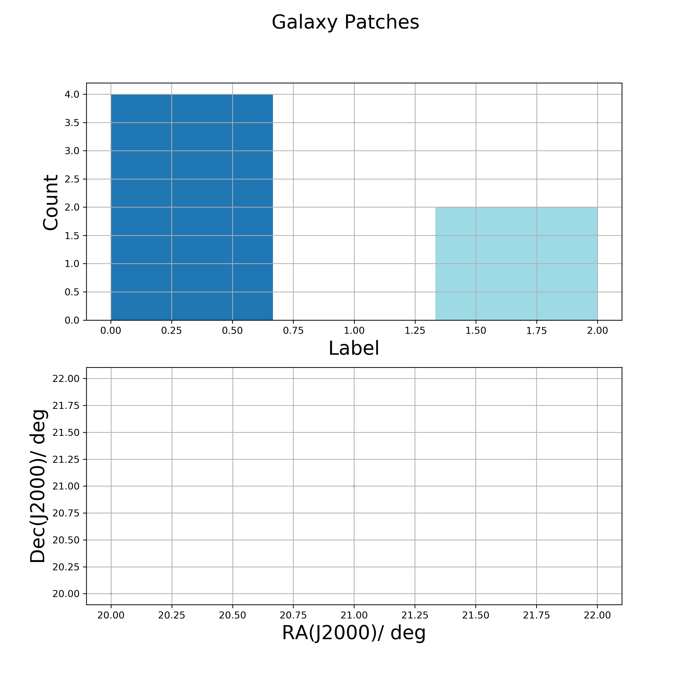

# Luminosity Function Constructor and Modeller

This packag allows the user to construct and model Galaxian Luminosity Functions using the $\frac{1}{V_{max}}$ estimator and Schechter function.  

       [](https://github.com/manasveesaraf/lumfunc/issues) [](https://github.com/manasveesaraf/lumfunc/stargazers)   [](https://github.com/manasveesaraf/lumfunc/network)  [](https://github.com/manasveesaraf/lumfunc/blob/master/LICENSE)

## Installation

Use the package manager [pip](https://pypi.org/project/lumfunc/) to install lumfunc.

```bash
pip install lumfunc
```

## Usage


```python
import lumfunc as lf
import numpy as np

lf.get_maggy(np.array([10, 100, 20])) # returns maggy values
```
<details><summary><b>get_maggy( )</b></summary>
<p>

Converts magnitudes into maggies.

```python
lf.get_maggy(np.array([10, 100, 20])) 
# returns array([1.e-04, 1.e-40, 1.e-08])
```

</p>
</details>

<details><summary><b>get_patches( )</b></summary>
<p>

Divides survey into equally distributed and equally sized patches. Returns labels for patches from RA, Dec, number of patches and patch center guesses.

```python
lf.get_patches(np.array([20, 21, 22, 20, 21, 22]),
            np.array([20, 21, 22, 20, 21, 22]),
            3,
            np.array([[20, 21], [22, 20], [21, 22], [20, 21], [22, 20],
                      [21, 22]]),
            survey='kids',
            numba_installed=True,
            plot_savename='test_patches.png')
# Displays the plot
```



</p>
</details>

## Dependencies
            

## Contributing
Pull requests are welcome. For major changes, please open an issue first to discuss what you would like to change.

Please make sure to update tests as appropriate.

## License
[MIT](https://github.com/manasveesaraf/LuminosityFunction/blob/master/LICENSE)